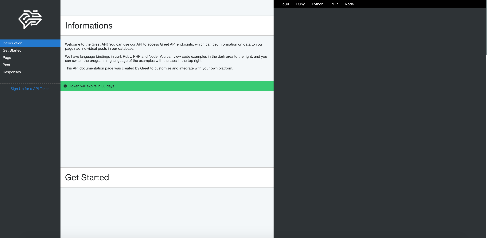

# GREET | API DOCS TEMPLATE

Api documentation made by GREET team, fully responsive, easy to edit.

You can find full product on [greet.chat](https://www.greet.chat/api_documentation) or [GitHub](https://liborzahradka.github.io/GreetAPI/).

## Built With

* HTML
* CSS
* JS (jQuery/Vanilla)

## Contributing

Feel free to contribute on this project.

## Versioning

We use [Heroku](https://heroku.com/) for versioning and deploy.

## Authors

* **Libor Zahradka** - [GitHub](https://github.com/liborzahradka) | [LinkedIn](https://www.linkedin.com/in/libor-zahradka-20818186/)
* **Cameron Burley** - [GitHub](https://github.com/) | [LinkedIn](https://www.linkedin.com/in/cam-burley-8b9b587/)

## Acknowledgments

* [HIGHLIGHT.JS](https://highlightjs.org)
